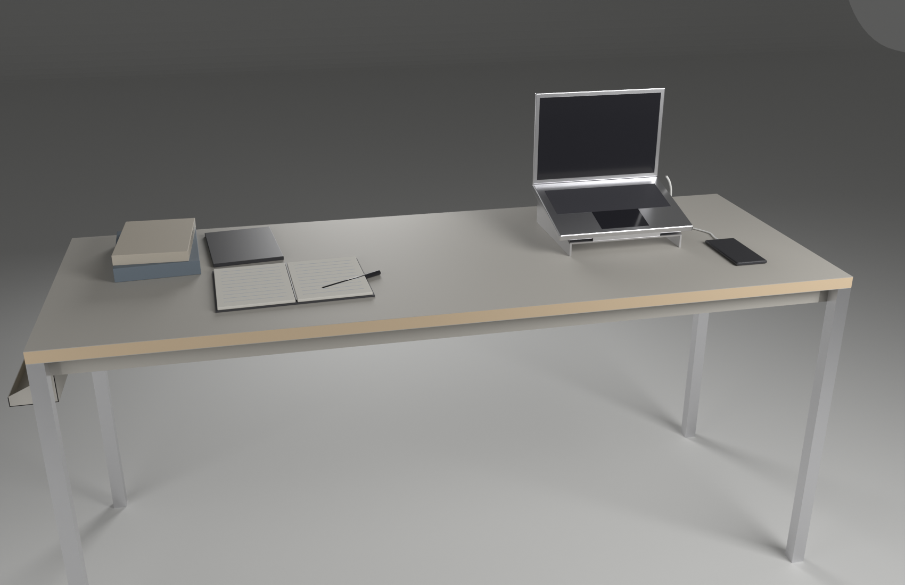
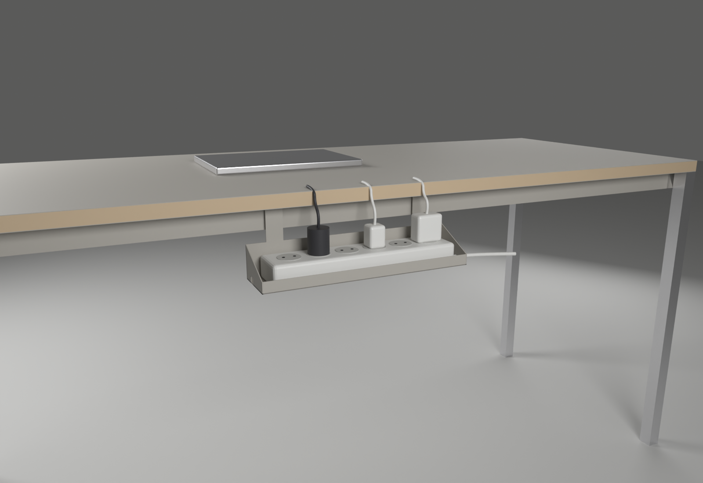
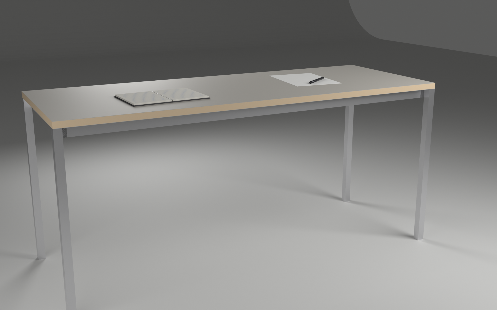
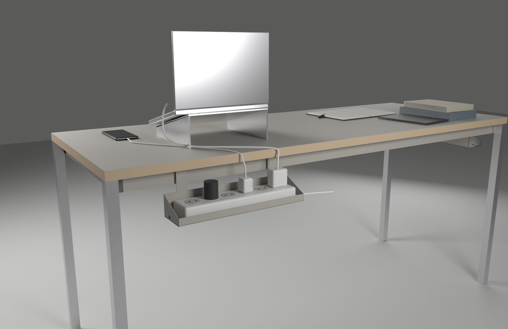
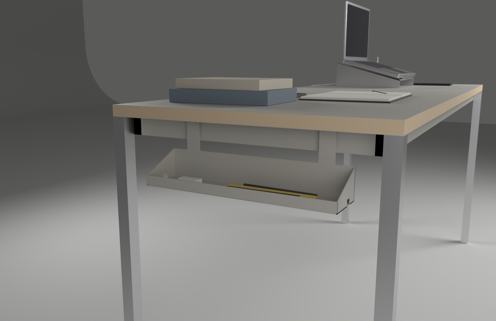
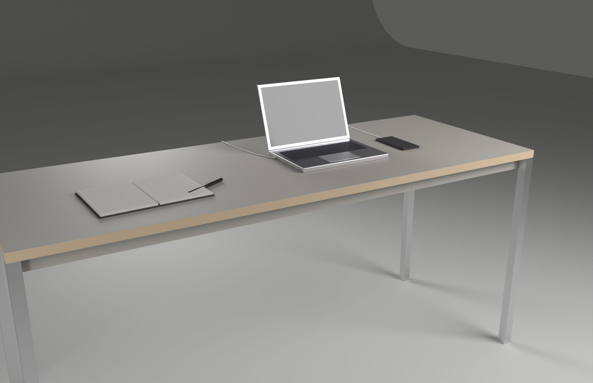

# 001 책상 — 160 × 60

_2026-10-07 완성 (1차) · 철학: [No more, No less](../../notes/no-more-no-less.md) · 작업 노트: [concepts/desk.md](../../concepts/desk.md), [concepts/power-box.md](../../concepts/power-box.md)_

## 이데아
**한 사람이 앉아서 생각을 펼칠 수 있는, 비어 있는 면.**
위에는 지금 쓰는 것만 있고, 나머지는 보이지 않는 곳에 있다.

## 기능
| # | 기능 | 어떻게 해결했나 |
|---|---|---|
| F1 | 작업하는 면을 받친다 | 상판 160 × 60 |
| F2·F3 | 앉고 서기, 사람마다 다른 키 | 1차는 높이 72cm 고정 (높이 조절은 다음 과제) |
| F4 | 위는 비어 있다 | 수납·전원을 모두 상판 아래로 |
| F5 | 안 쓰는 물건(멀티탭, 필기구)은 위가 아닌 곳에 | 프레임에 자석으로 붙는 상자 한 종류 |
| F6 | 생각을 펼칠 만큼 넓다 | 80cm 작업 영역 두 칸 |
| F9 | 앉은 자리에서 손이 닿는다 | 깊이 60 = 실제로 쓰는 깊이 (최대 작업 영역 55~65cm) |

## 최종 사양
| 부분 | 사양 | 이유 |
|---|---|---|
| 상판 | 1600 × 600 × 25mm, 자작합판 + 위아래 무광 마감 | 두 칸(80×2), 손 닿는 깊이, 휨 방지 |
| 상판 색 | 따뜻한 밝은 회색, 반사율 약 45% | 흰 종이와 1.8:1 — 종이는 또렷, 눈은 편함. 무늬·광택 없음 |
| 높이 | 720mm 고정 | 일반 앉는 책상 높이 |
| 다리 | 알루미늄 30×30mm 사각관, 칠 없음, 모서리 끝 | 책상끼리 붙이면 하나로 보임, 끝을 짚어도 안정, 긁힘에 강함 |
| 프레임 | 강철 40×20mm, 분체도장(상판 색), 다리 안쪽 면 | 흔들림 방지 + 자석이 붙는 면 / 숨어 있어 칠해도 안 보임 |
| 연결 | 다리–프레임 볼트, 절연 와셔 | 분해 가능, 알루미늄–강철 부식 방지 |
| 수납 상자 | 380 × 86mm 알루미늄, 탭 2개 끝 자석(고무 덮개) | 6구 멀티탭(337.8×73.5mm) 기준 한 가지 크기, 멀티탭·필기구 겸용 |

## 수납 상자

- 높은 벽(6cm) 위의 탭 자석이 프레임에 툭 붙는다. 안쪽·바깥쪽, 뒤·옆 어디든.
- 낮은 턱(2cm)이 열린 쪽 → 플러그 선이 그쪽으로 빠진다. 양쪽 옆판 아래 꼬리 홈.
- 권장: 멀티탭은 뒤 레일 바깥(선이 바로 위로 올라가 뒤 모서리를 넘음), 필기구는 손 쪽 옆 레일.

## 과정과 결정
| 단계 | 질문 | 결정 | 그림 |
|---|---|---|---|
| 형태 | 사각 vs 몸을 감싸는 곡선? | 곡선(초승달)이 손 닿는 범위에 정확 → 깊이 일정한 휜 띠 → 만들기 어려움 | [곡선 비교](../../concepts/img/desk_shapes_A.png), [휜 띠](../../concepts/img/desk_band.png) |
| 모듈 | 사각+삼각 조각을 조합? | 조각 한 종류(80×60)까지 줄였지만, 직선으로 쓸 거면 한 장이 낫다 → 모듈 포기 | [조합](../../concepts/img/desk_connectors.png), [한 종류](../../concepts/img/desk_single_unit.png) |
| 크기 | 한 사람의 작업 단위는? | 80 × 60 (지금 책상 한 칸 + 손 닿는 깊이) → 작은 책상 1칸, 큰 책상 2칸(160×60) | |
| 색 | 무슨 색? | 밝은 무채색 중 따뜻한 밝은 회색 45% | [6색](../../renders/001_desk_colors.png), [밝은 색](../../renders/001_desk_colors_light.png), [선택](../../renders/001_desk_color_pick.png) |
| 다리 위치 | 붙였을 때 하나로 보이려면? | 모서리 끝, 사각 | [결합 비교](../../renders/001_desk_legs_join.png) |
| 다리 색 | 같은 색 vs 알루미늄? | 알루미늄 (긁힘, 칠 없음) | [비교](../../renders/001_desk_big_legs.png) |
| 흔들림 | 다리 위치로 해결? | 아니다 — 프레임이 막는다. 처짐 최소 위치(끝에서 36cm)는 끝이 떠서 불안 | [비교](../../renders/001_desk_big_frame.png), [구조](../../renders/001_desk_big_structure.png) |
| 수납 | 어디에 어떻게? | 프레임 홈 → 자석 → 구멍+고리 → 결국 '자석 상자 한 종류' | [강철 프레임](../../renders/001_desk_steel.png) |
| 상자 | 어떤 모양? | 위 열린 쟁반 → 등판 → 탭 2개 → 실제 멀티탭 치수 → 열린 쪽을 바깥으로 | [v3](../../renders/002_box_v3_front.png), [v5](../../renders/002_box_v5_front.png), [v6](../../renders/002_box_v6_side.png) |

## 이미지
| | |
|---|---|
|  확정안 |  뒤에서: 멀티탭 상자와 충전선 |
|  왼쪽: 펜 상자 |  충전 중 |

3D 파일: `exports/001_desk_big_final.blend` (노트북용 가벼운 버전 `_light.blend`), `.glb`

## 남은 과제
- 높이 조절(F2·F3) — 지금은 72cm 고정. 의자 002에서 다시 열림(2026-10-08): 오래 앉기도 오래 서기도 해롭다 → 서는 게 이상이 아니라 '한 상태로 오래 있지 않기'. 책상 높이 조절 / 높은 의자 / 공간에서 일어날 이유 만들기 중 검토
- 작은 책상 80 × 60
- 상판 옆면 (합판 결을 드러낼지, 감쌀지), 마감재(리놀륨 vs HPL)
- 충전선이 뒤 모서리를 넘는 부분 — 그대로 둘지, 작은 홈을 낼지
- 펜 상자로 쓸 때 상판 아래 12cm까지 내려오는 깊이
